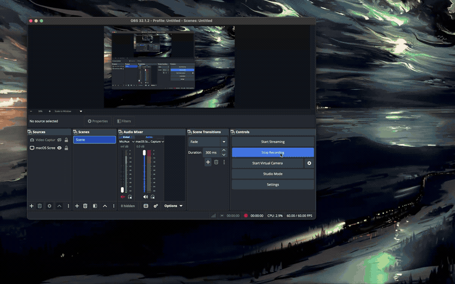
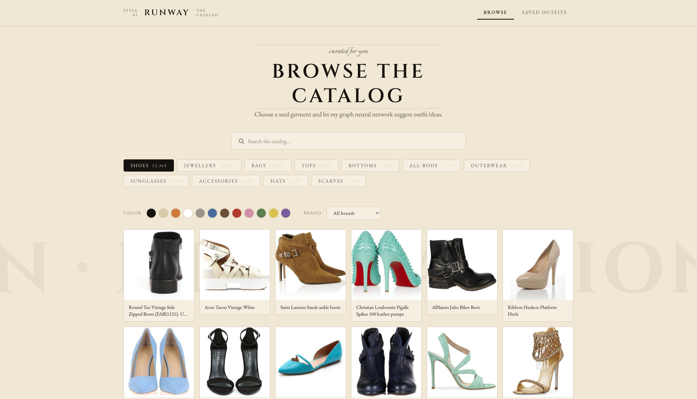
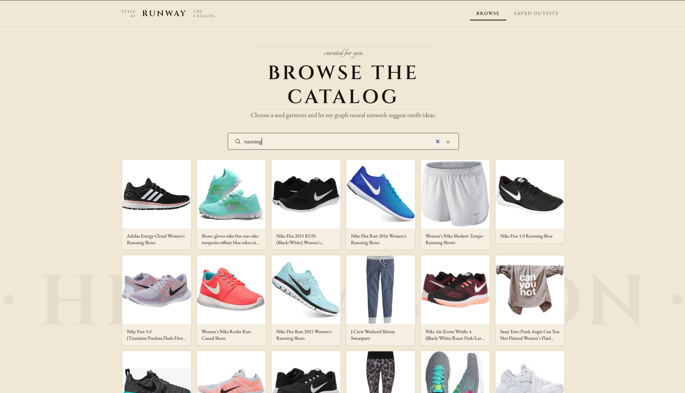
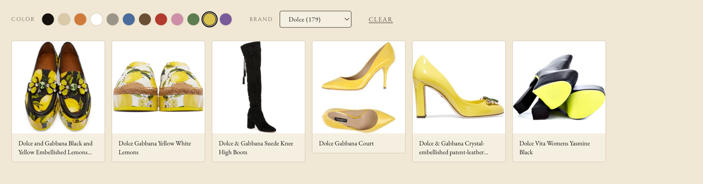
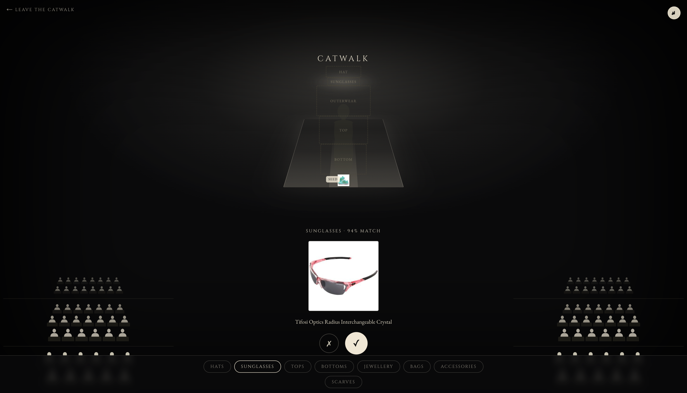
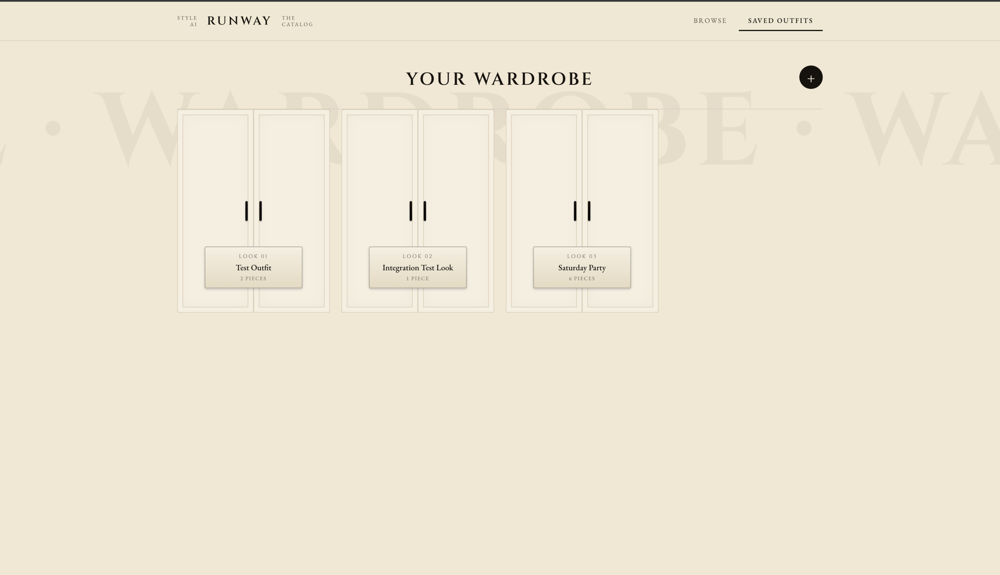
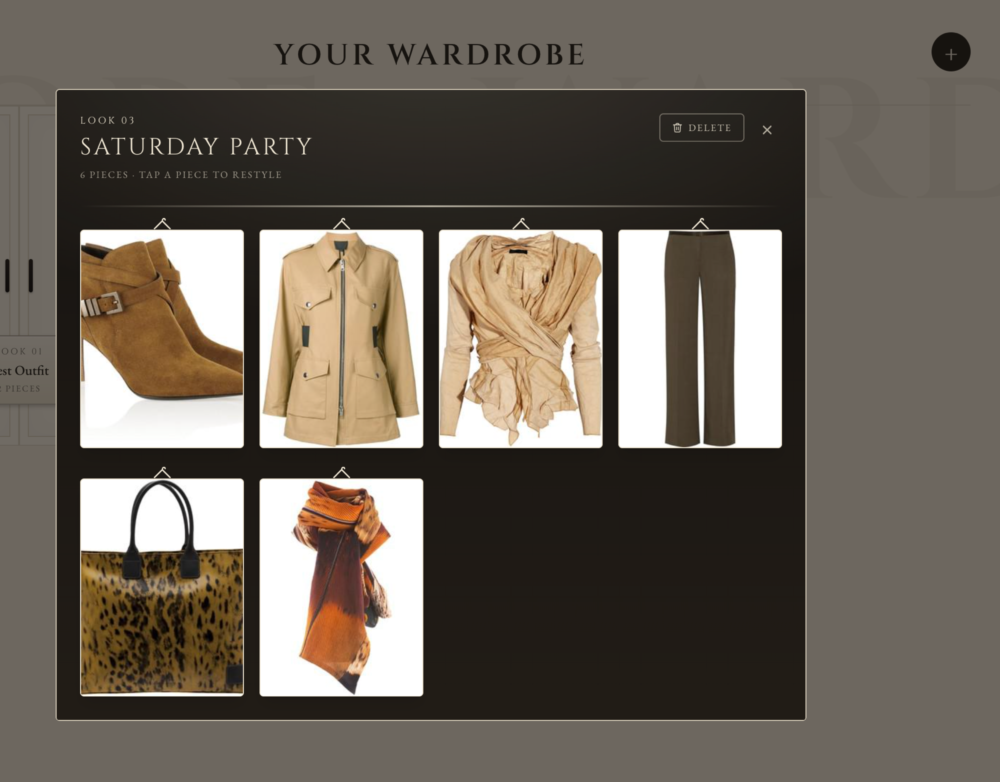
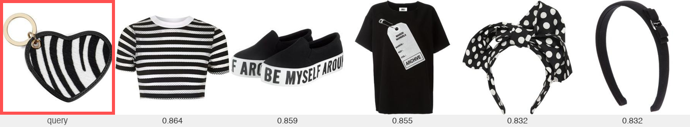
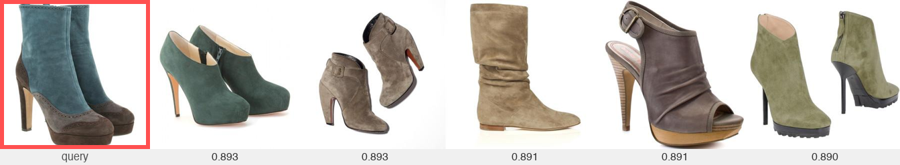
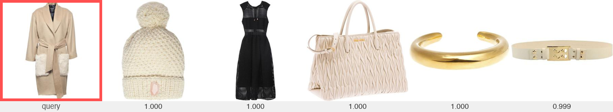

# Runway

**AI stylist that learns what actually goes together.** Most fashion recommenders surface *similar* items ("you liked this shirt, here's another shirt"). Runway learns *compatibility*: what goes together in the same outfit. I trained a graph neural network on how garments are co-worn across 35,140 real Polyvore outfits. Those learned embeddings search and browse a 72k-item catalog, filter by color and brand, then step onto a dark **Catwalk** where you assemble a head-to-toe look one piece at a time, the model proposes matches, and a crowd cheers you on.



---

## A look around

| Browse the catalog | Search |
|---|---|
|  |  |
| Cream + black editorial catalog of 72k garments, by category. | Full-text search across the catalog. |

| Filter by color + brand | The Catwalk |
|---|---|
|  |  |
| Real colors extracted from product images; brands parsed from titles. | Theatre: pick a slot, get one suggestion at a time --> accept or reject. |

| Your Wardrobe | A saved look |
|---|---|
|  |  |
| Saved outfits, each hung in its own closet. | Open a closet to see every piece; tap one to restyle around it. |

---

## Results

Evaluated **inductively** and **leakage-free** on the full Polyvore Outfits disjoint test split (0 items skipped):

| Metric | Value | Notes |
|---|---|---|
| Compatibility AUC | **0.848** | 30,290 candidate outfit pairs |
| Fill-in-the-blank accuracy | **0.623** | 15,145 questions |
| Recall@10 | 0.0043 | |
| Recall@30 | 0.0095 | Ranking one held-out item against all 152,785 catalog items |
| Recall@50 | 0.0161 | ~13 to 49x random baseline |
| API latency (P99) | ~2 ms | Compatibility/retrieval path, measured locally |
| Test suite | 226 passing | pytest + ruff clean, plus vitest on the frontend reducer |

**Dataset:** Polyvore Outfits (`disjoint` split): 152,785 items embedded, 35,140 outfits (train 16,995 / valid 3,000 / test 15,145).

### The leakage fix

An early evaluation ran the HGAT `forward` pass over a graph that included test-split outfits. Test garments were embedded via message-passing that incorporated test co-occurrence signal. This produced an inflated AUC of ~**0.99**.

The fix was to switch to strict **inductive** evaluation: all test embeddings are produced via `model.embed_features(x)`, which runs only the MLP encoder on image+text features with no graph context. This is exactly how the deployed product embeds every catalog garment it scores at serve time. The reported **0.848** is the right number.

---

## Qualitative examples

Top-5 compatible suggestions for three query garments, ranked by type-aware cosine similarity in learned 256-d embedding space:







---

## Architecture

```
Polyvore Outfits (Kaggle API)
        │
        ▼
  data/polyvore.py          Parse JSON to Item / Outfit dataclasses
  data/splits.py            Outfit-disjoint train / val / test
        │
        ▼
  embeddings/
    clip_encoder.py         open_clip ViT-B/32 to 512-d image vector
    text_encoder.py         sentence-transformers MiniLM-L6-v2 to 384-d
    fusion.py               Concat + L2-norm to 896-d fused vector
        │
        ▼
  graph/builder.py          PyG HeteroData bipartite graph
                            garment nodes (x = 896-d fused embeddings)
                            outfit nodes  (x = zeros, learned via GAT)
                            edges: garment to/from outfit
        │
        ▼
  training/
    trainer.py              Mini-batch subgraph training (TRAIN outfits only)
    loss.py                 Type-aware InfoNCE contrastive loss
    negatives.py            CLIP-mined hard negatives (visually similar, not co-worn)
        │
        ▼
  data/models/vN/           Versioned checkpoint: model.pt + meta.json
        │
  ┌─────┴──────────────────────────────────────────┐
  │                                                 │
  ▼                                                 ▼
scripts/seed_catalog.py                   models/hgat.py embed_features(x)
Export 256-d embeddings to pgvector       Inductive path: MLP encoder only,
IVFFlat cosine index                      no graph needed at serve time
        │                                           │
        └──────────────────────┬────────────────────┘
                               │
                               ▼
                    FastAPI (api/)
                    GET  /catalog/categories  Semantic categories with counts
                    GET  /catalog/items       Paginated items, filter by color/brand
                    GET  /catalog/facets      Available colors + brands per category
                    GET  /catalog/search      Full-text catalog search (tsvector)
                    GET  /items/{id}/outfit-suggestions  Grouped per-category suggestions
                    POST /compatibility  TypeAwareScorer in 67 type-pair subspaces
                    POST /feedback      Publish rating to Redis Stream
                    POST /outfits       Save outfit history
                               │
                    ┌──────────┴──────────┐
                    │                     │
                    ▼                     ▼
              pgvector             Redis Streams
         (ANN retrieval)        (feedback ingestion)
                                        │
                                        ▼
                               feedback/stream.py
                               Batch consumer to Postgres ratings
                               feedback/trigger.py
                               should_retrain() to scripts/retrain.py
                               (versioned retrain when threshold crossed)
                               │
                               ▼
                    Next.js frontend (web/)
                    Browse + search + color/brand filters · The Catwalk builder · Wardrobe
```

See [`docs/architecture.md`](docs/architecture.md) for deep coverage of model internals, training details, the leakage fix, database schema, Redis Streams design, and the deferred AWS architecture.

---

## Model: v7 HGAT

**Type-aware Heterogeneous Graph Attention Network.**

- **Encoder:** deep nonlinear MLP over fused 896-d features: `Linear(896→512) → LayerNorm → GELU → Dropout → Linear(512→256) → LayerNorm → GELU → Dropout`. Hidden dim 256.
- **GAT layers:** 2 stacked `HeteroConv` layers, each with separate `GATConv` modules for both edge directions (`garment→outfit`, `outfit→garment`). 4 attention heads, mean-aggregation, residual connections.
- **Inductive cold-start:** `embed_features(x)` = `L2_norm(encoder(x))`. Identical to `forward` for an isolated node, zero representation gap for cold-start garments scored at serve time.
- **Type-aware subspaces:** 67 learned per-type-pair subspaces (66 from Polyvore `typespaces.p` + 1 fallback) via non-negative masks over shared embeddings, following Vasileva et al. 2018. Compatible items of complementary types score highly even when visually dissimilar.
- **Training:** InfoNCE contrastive loss, CLIP-mined hard negatives (visually similar but not co-worn), bounded shared negative pool (256 items), mini-batch subgraph training, neighbor dropout (p=0.1), 25 epochs on Apple Silicon MPS.

---

## Tech stack

| Layer | Libraries / Tools |
|---|---|
| GNN | PyTorch, PyTorch Geometric |
| Vision encoder | open_clip (ViT-B/32) |
| Text encoder | sentence-transformers (MiniLM-L6-v2) |
| Color extraction | Pillow + NumPy (HSV palette classification over product images) |
| Inference API | FastAPI, uvicorn |
| Vector search | Postgres + pgvector (IVFFlat cosine index) |
| Feedback loop | Redis Streams (XADD / XREADGROUP / XACK) |
| ORM / queries | SQLAlchemy 2, psycopg3 |
| Frontend | Next.js 16, React 19, TypeScript, Tailwind v4, Framer Motion |
| Local infra | Docker Compose (pgvector:pg16, redis:7-alpine) |
| CI | GitHub Actions (pytest + ruff) |
| Packaging | pyproject.toml, setuptools |

The Python package is `fitgraph` (the project's working name); the product is branded **Runway**.

---

## Quickstart

Requirements: Python 3.12+, Docker, Node.js 18+, a [Kaggle API token](https://www.kaggle.com/docs/api).

```bash
# 1. Start Postgres (pgvector) and Redis
docker compose up -d

# 2. Create venv and install the package + dev deps
python3 -m venv .venv && .venv/bin/pip install -e ".[dev]"

# 3. Download Polyvore Outfits via Kaggle API
.venv/bin/python scripts/download_data.py

# 4. Generate CLIP + text embeddings
#    Default: 5,000-outfit subset.  Add --full for all 35k outfits.
.venv/bin/python scripts/build_embeddings.py

# 5. Train the HGAT
#    Default: subset.  Add --full for the full dataset run.
.venv/bin/python scripts/train.py

# 6. Run evaluation (AUC, FITB, Recall@K, qualitative grids)
.venv/bin/python scripts/evaluate.py

# 7. Seed pgvector catalog with learned embeddings
#    Replace <v> with the version printed by train.py (e.g. v7)
.venv/bin/python scripts/seed_catalog.py \
  --embeddings data/models/<v>/catalog_embeddings.npz \
  --model-version <v>

# 8. Extract a dominant color + brand per item (powers the catalog filters)
.venv/bin/python scripts/extract_facets.py

# 9. Point the frontend at the API and install deps
echo "NEXT_PUBLIC_API_URL=http://localhost:8011" > web/.env.local
cd web && npm install && cd ..
```

### Running the app

**Recommended**

```bash
scripts/demo_up.sh     # Docker + API (:8011) + prod web (:3012) + memory watchdog
scripts/demo_down.sh   # stop everything
```

Then open **http://localhost:3012**.

> Note for 16 GB Macs: prefer `scripts/demo_up.sh` (a production build) over `npm run dev`. Next.js 16's Turbopack compiles the homepage route on demand the first time a browser loads it, and that dev-mode compile can balloon system memory to ~8 GB in seconds, enough to thrash swap and hard-freeze the machine. The production build serves the same page in ~1 GB, and `demo_up.sh` runs a memory-pressure watchdog seatbelt. On a machine with 32 GB or more, `cd web && npm run dev` is fine.

The default config trains on a 5,000-outfit subset so an end-to-end run completes quickly on a laptop. Add `--full` to steps 4 and 5 to reproduce the published 0.848 AUC (35k outfits, 152k items, ~25 epochs on Apple Silicon MPS).

---

## Project structure

```
runway/  (package: fitgraph)
├── src/fitgraph/
│   ├── config.py           Central config: paths, hyperparameters, env-driven
│   ├── data/               Polyvore parsing, dataclasses, outfit-disjoint splits
│   ├── embeddings/         CLIP image encoder, sentence-transformer text encoder, fusion
│   ├── graph/              Bipartite HeteroData builder (garment to/from outfit)
│   ├── models/
│   │   ├── hgat.py         Heterogeneous GAT + inductive embed_features path
│   │   └── type_aware.py   TypeAwareScorer: 67 learned type-pair subspaces
│   ├── training/           InfoNCE loss, hard-negative mining, train loop, versioning
│   ├── eval/               AUC, FITB accuracy, Recall@K, qualitative grid renderer
│   ├── retrieval/          pgvector ANN client (cosine IVFFlat)
│   ├── db/                 schema.sql, SQLAlchemy query layer (joins, FTS, facets)
│   ├── feedback/           Redis Streams producer/consumer, retrain trigger
│   └── api/                FastAPI routes, request/response schemas, ModelService
├── scripts/
│   ├── download_data.py    Kaggle API download
│   ├── build_embeddings.py CLIP + text encoding for all catalog items
│   ├── train.py            Training entry point
│   ├── evaluate.py         Full evaluation suite
│   ├── seed_catalog.py     Export embeddings to pgvector
│   ├── extract_facets.py   Dominant color (from image) + brand per item
│   ├── retrain.py          Triggered retrain with feedback signal
│   └── demo_up.sh          One-command production launch + memory watchdog
├── web/                    Next.js 16 + TypeScript + Tailwind frontend
│   └── components/show/    The Catwalk: dark-theatre outfit builder
├── tests/                  pytest suite (+ vitest for the show reducer)
├── docs/
│   ├── architecture.md     Full technical reference
│   └── assets/             demo.mp4/gif, screenshots, qualitative grids
├── docker-compose.yml      pgvector:pg16 + redis:7-alpine
└── .github/workflows/      CI: pytest + ruff
```

---

## Active learning loop

User ratings flow through the system without requiring a server restart:

1. Feedback in the frontend calls `POST /feedback`.
2. The API publishes a rating event to the Redis Stream `fitgraph:feedback` via `XADD`.
3. A batch consumer (`feedback/stream.py`, `XREADGROUP`) drains the pending-entry list, persists each as a `Rating` row in Postgres, and acknowledges with `XACK`. Malformed messages are still acknowledged to prevent infinite replay.
4. `feedback/trigger.py::should_retrain()` checks cumulative new-rating volume against a configurable threshold.
5. When the threshold is crossed, `scripts/retrain.py` rebuilds the graph incorporating rating signal, trains a new versioned model, registers it in the `model_versions` table, and the `ModelService` can hot-swap to the new checkpoint without restarting.

---

## Production deployment (not wired)

The intended AWS deployment is **designed and documented but not provisioned**. The current repo runs fully locally via Docker Compose. Nothing in the codebase connects to AWS.

```
Intended AWS deployment (designed, not wired)
─────────────────────────────────────────────
  ECS Fargate           FastAPI + model container
    └─ IAM role         Least-privilege, no long-lived keys

  S3 bucket             Product images + trained model checkpoints
  RDS Postgres          pgvector extension for vector search
  ElastiCache Redis     Feedback stream
  CloudWatch Logs       Structured log aggregation

  AWS CDK (TypeScript)  Infrastructure as code
  GitHub Actions        Post-CI: push image to ECR, update ECS service
  Vercel                Next.js frontend deployment
```

See the full intended architecture in [`docs/architecture.md`](docs/architecture.md#deferred-production-architecture-designed-but-not-implemented).

